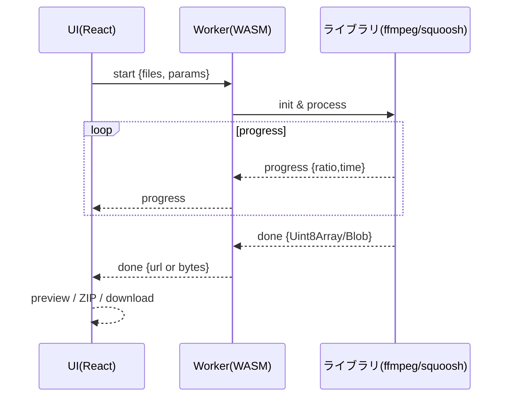

# convert-media（フロントエンド単体・個人開発）

画像/動画の「圧縮・変換・リサイズ」を左メニューから選ぶ「1ページ=1機能」のシンプルSPA。処理は全てブラウザ内（WASM）で完結し、サーバ保存やバックエンド処理は行いません。

---

## サイトマップ / フロー（Mermaid）

```mermaid
flowchart LR
  subgraph Sidebar[左サイドメニュー]
    I1[画像 圧縮]
    I2[画像 変換]
    I3[画像 リサイズ]
    V1[動画 圧縮]
    V2[動画 変換]
    V3[動画 リサイズ]
  end

  I1 --> P_ImageCompress[/image/compress]
  I2 --> P_ImageConvert[/image/convert]
  I3 --> P_ImageResize[/image/resize]
  V1 --> P_VideoCompress[/video/compress]
  V2 --> P_VideoConvert[/video/convert]
  V3 --> P_VideoResize[/video/resize]

  classDef page fill:#eef,stroke:#99f,stroke-width:1px;
  class P_ImageCompress,P_ImageConvert,P_ImageResize,P_VideoCompress,P_VideoConvert,P_VideoResize page;
```

---

## 技術スタック（最小）

| 区分 | ライブラリ/技術 | 用途 | 主な利用箇所 |
|---|---|---|---|
| 言語/環境 | TypeScript 5+, Node.js 20+ | 型安全/開発環境 | 全体 |
| ビルド | Vite | Dev/Build/Preview | ルートスクリプト |
| UI | React 18 | SPA UI | `src/*` |
| ルーティング | React Router | ページ遷移 | `src/routes/*` |
| スタイル | CSS Modules | スタイル管理 | `src/styles/*` |
| フォーム | React Hook Form + Zod | 入力/検証 | 各設定フォーム |
| 画像処理 | `@squoosh/lib` | エンコード/リサイズ | 画像系ページ/Worker |
| 動画処理 | `@ffmpeg/ffmpeg` | エンコード/スケール | 動画系ページ/Worker |
| 一括DL | `jszip` | ZIP生成 | DL処理 |

注: すべてフロントで完結（外部SaaS/バックエンド不要）。

---

## ルーティングと使用ライブラリ

| パス | 機能 | 主要ライブラリ | 備考 |
|---|---|---|---|
| `/image/compress` | 画像 圧縮 | `@squoosh/lib`, Canvas | 入力形式維持で再エンコード |
| `/image/convert` | 画像 変換 | `@squoosh/lib` | 指定形式へ変換（JPEG/PNG/WebP/AVIF） |
| `/image/resize` | 画像 リサイズ | `@squoosh/lib`, Canvas | リサイズ後にエンコード |
| `/video/compress` | 動画 圧縮 | `@ffmpeg/ffmpeg` | H.264/AAC で容量削減 |
| `/video/convert` | 動画 変換 | `@ffmpeg/ffmpeg` | MP4(H.264/AAC) or WEBM(VP9/Opus) |
| `/video/resize` | 動画 リサイズ | `@ffmpeg/ffmpeg` | 長辺指定でスケール |

---

## Worker フロー（Mermaid）



---

## ページ別 仕様（デフォルト/実装要点）

### 画像 - 圧縮 `/image/compress`
- 目的: 入力形式を維持しつつ容量削減
- 使用: `@squoosh/lib`（mozjpeg/oxipng/webp/avif）, Canvas（プレビュー）

| 形式 | エンコーダ | 既定値 | 備考 |
|---|---|---|---|
| JPEG | mozjpeg | quality 0.75, 4:2:0 | baseline 推奨 |
| PNG | oxipng | level 3（lossless） | 速度と圧縮のバランス |
| WebP | libwebp | quality 0.75, effort 4 | lossy |
| AVIF | libavif | cq 30, effort 4 | 高圧縮・遅め |

実装要点
- 形式を判別して再エンコード（メタデータは既定で削除）。
- Before/After プレビューと削減率表示。

### 画像 - 変換 `/image/convert`
- 目的: 指定形式（JPEG/PNG/WebP/AVIF）へ変換
- 使用: `@squoosh/lib`

| 出力形式 | 既定値 | 備考 |
|---|---|---|
| JPEG | quality 0.8 | 高品質寄り |
| PNG | lossless | 透過保持 |
| WebP | quality 0.8 | ブラウザ互換性高 |
| AVIF | cq 28 | さらに小さく（遅い） |

実装要点
- デコード→指定コーデックでエンコード。
- ICC/EXIF は既定で削除（保持オプション可）。

### 画像 - リサイズ `/image/resize`
- 目的: 寸法変更（アスペクト維持）
- 使用: `@squoosh/lib`（resize オプション）, Canvas

| パラメータ | 既定 | 備考 |
|---|---|---|
| 長辺 | 1920px | 等倍も選択可 |
| フィット | contain | アスペクト維持 |
| 補間 | lanczos | 可能なら選択 |
| 出力形式 | 入力と同一 | 変更可 |

実装要点
- 先にリサイズ→次にエンコード（効率/画質）。

### 動画 - 圧縮 `/video/compress`
- 目的: H.264/AAC で容量削減
- 使用: `@ffmpeg/ffmpeg`

| 項目 | 既定 | ffmpeg 例 |
|---|---|---|
| 映像 | crf 23, preset medium | `-c:v libx264 -crf 23 -preset medium -pix_fmt yuv420p` |
| 音声 | aac 128k / 2ch | `-c:a aac -b:a 128k -ac 2` |
| 解像度 | 維持（任意で長辺1280） | `-vf scale=...` |
| FPS | 維持（任意で 30） | `-r 30` |

実装要点
- 例: `-i in -c:v libx264 -crf 23 -preset medium -pix_fmt yuv420p -c:a aac -b:a 128k -movflags +faststart`。
- ログ解析で進捗比率を算出。

### 動画 - 変換 `/video/convert`
- 目的: MP4(H.264/AAC) または WEBM(VP9/Opus)
- 使用: `@ffmpeg/ffmpeg`

| 出力 | 映像 | 音声 |
|---|---|---|
| MP4 | `-c:v libx264 -crf 23 -preset medium` | `-c:a aac -b:a 128k` |
| WEBM | `-c:v libvpx-vp9 -crf 32 -b:v 0` | `-c:a libopus -b:a 128k` |

実装要点
- 拡張子に応じてパラメータを切替。

### 動画 - リサイズ `/video/resize`
- 目的: 長辺指定でスケール（偶数丸め）
- 使用: `@ffmpeg/ffmpeg`

| パラメータ | 既定 | ffmpeg 例 |
|---|---|---|
| 長辺 | 1280px | `-vf scale='if(gt(a,1),min(1280,iw),-2)':'if(gt(a,1),-2,min(1280,ih))'` |
| 品質 | crf 23, preset medium | `-c:v libx264 -crf 23 -preset medium` |
| 音声 | 既存コピー or aac 128k | `-c:a copy` or `-c:a aac -b:a 128k` |

実装要点
- スケール後はピクセル偶数に調整してエンコード。

---

## WASM/Worker 設計

| 項目 | 内容 |
|---|---|
| WASM配置 | `public/wasm/ffmpeg/ffmpeg-core.*`, `public/wasm/squoosh/*` |
| 遅延ロード | 各ページで初回 `import()`、使用時にのみ読み込み |
| 初期化例 | ffmpeg: `createFFmpeg({ corePath: '/wasm/ffmpeg/ffmpeg-core.js' })` |
| Worker | `workers/ffmpegWorker.ts`, `workers/squooshWorker.ts` |
| メッセージ型 | `{ type: 'start' | 'progress' | 'error' | 'done', payload }` |

---

## 共有コンポーネント

| コンポーネント | 役割 |
|---|---|
| `Sidebar` | 6機能へのナビゲーション |
| `Dropzone` | D&D/選択、MIME/サイズ検証（Zod） |
| `ProgressBar` | 全体/ファイル別の進捗表示 |
| `ImagePreview`/`VideoPreview` | Before/After、サムネ/短尺プレビュー |
| `SettingsForm` | RHF + Zod で設定管理 |

---

## ディレクトリ例

```
src/
  app.tsx
  main.tsx
  routes/
    image/Compress.tsx
    image/Convert.tsx
    image/Resize.tsx
    video/Compress.tsx
    video/Convert.tsx
    video/Resize.tsx
  components/
    Sidebar.tsx
    Dropzone.tsx
    ProgressBar.tsx
    ImagePreview.tsx
    VideoPreview.tsx
  workers/
    ffmpegWorker.ts
    squooshWorker.ts
  lib/
    ffmpeg.ts
    squoosh.ts
    zip.ts
  styles/
    globals.css
public/
  wasm/ffmpeg/
  wasm/squoosh/
```

---

## パフォーマンス/制約（目安）

| 種別 | 快適目安 | 注意点 |
|---|---|---|
| 画像 | 〜50MB/枚 | 100MB超は遅くなる |
| 動画 | 数百MB/本 | 端末性能で大きく変動 |

実装上のポイント
- Worker で重処理を隔離、UIをブロックしない。
- 画像は「先にリサイズ→後でエンコード」。
- 動画は `-crf/-preset` のバランスで時間/画質を調整。

---

## 依存とスクリプト（例）

| コマンド | 説明 |
|---|---|
| `pnpm add react react-dom react-router-dom` | 主要依存 |
| `pnpm add @ffmpeg/ffmpeg @squoosh/lib jszip zod react-hook-form` | 機能依存 |
| `pnpm add -D typescript vite @types/react @types/react-dom eslint prettier vitest jsdom @testing-library/react @testing-library/jest-dom @testing-library/user-event` | 開発/テスト依存 |
| `pnpm dev` | 開発サーバ |
| `pnpm build` | ビルド（`dist/`） |
| `pnpm preview` | ローカルプレビュー |
| `pnpm lint` / `pnpm lint:fix` | ESLint 実行 / 自動修正 |
| `pnpm format` / `pnpm format:check` | Prettier で整形 / 差分確認 |
| `pnpm test` / `pnpm test:watch` / `pnpm test:coverage` | Vitest 実行 / 監視 / カバレッジ |

---

## コーディング規約/テスト（最小）

| 項目 | ルール |
|---|---|
| TypeScript | `strict: true`, `noImplicitAny`, `strictNullChecks` |
| Lint/Format | ESLint + Prettier、未使用禁止・import順 |
| 命名 | ファイル`kebab-case`、型/コンポーネント`PascalCase`、変数/関数`camelCase` |
| テスト | 単体: パラメータ/検証、UI: Dropzone/Progress/フォーム、簡易E2E（任意） |

### コミットメッセージ（日本語）
- Conventional Commits を採用（例: `feat: 画像圧縮ページの設定フォームを追加`）。
- 共同署名は禁止（`Co-authored-by` 行を付けない）。
- 任意でテンプレートを設定: `git config commit.template .gitmessage`。

### 作業フロー（必須ルール）
- 実装後はローカルで動作確認（`npm run dev` で画面、`npm run test` でテスト、必要に応じ `npm run build`）。
- 動作確認が終わったら、Gitにコミット（日本語Conventional Commits）し、変更内容がREADMEに反映されているか確認・更新する。
- READMEに影響する仕様/画面/コマンドの差分があれば、同一PRでREADMEを必ず更新する。

---

本READMEはフロントエンド（ブラウザ内完結）に必要な情報のみを記載しています。ページ別のライブラリ・デフォルト・実装要点を表で整理し、Mermaidで構成/フローを可視化しています。

---

## コーディング詳細（実装仕様）

### 共通設定/定数（`src/lib/constants.ts`）

| 定数 | 値/例 | 用途 |
|---|---|---|
| `MAX_IMAGE_SIZE_MB` | 100 | 画像の警告閾値 |
| `MAX_VIDEO_SIZE_MB` | 800 | 動画の警告閾値 |
| `MAX_FILES` | 20 | 同時ファイル上限 |
| `ZIP_FILENAME_FORMAT` | `convert-media_{date}_{time}.zip` | 一括DL名 |
| `FILENAME_PATTERN` | `{base}_{op}{params}.{ext}` | 個別DL名 |

備考: 制限超過時は確認ダイアログ（続行/中断）。

### フォーム項目仕様（ページ別）

画像 圧縮 `/image/compress`
| key | ラベル | 型 | 範囲/選択 | 既定 | バリデーション/備考 |
|---|---|---|---|---|---|
| `format` | 出力形式 | enum | jpeg/png/webp/avif/auto | `auto` | `auto`は入力と同一 |
| `jpeg.quality` | JPEG品質 | number | 0–1 step 0.01 | 0.75 | `z.number().min(0).max(1)` |
| `webp.quality` | WebP品質 | number | 0–1 | 0.75 | 同上 |
| `avif.cq` | AVIF品質(CQ) | int | 0–63 | 30 | 小さいほど高品質 |
| `effort` | エンコード速度 | int | 0–9 | 4 | 速度/圧縮のバランス |
| `stripMeta` | メタ削除 | boolean | - | true | EXIF/ICC を削除 |

画像 変換 `/image/convert`
| key | ラベル | 型 | 範囲/選択 | 既定 | 備考 |
|---|---|---|---|---|---|
| `targetFormat` | 出力形式 | enum | jpeg/png/webp/avif | `webp` | |
| `jpeg.quality` | JPEG品質 | number | 0–1 | 0.8 | |
| `png.lossless` | PNG可逆 | boolean | - | true | oxipng level 3 |
| `webp.quality` | WebP品質 | number | 0–1 | 0.8 | |
| `avif.cq` | AVIF品質 | int | 0–63 | 28 | |
| `keepICC` | ICC保持 | boolean | - | false | 色差が気になる場合のみ |

画像 リサイズ `/image/resize`
| key | ラベル | 型 | 範囲/選択 | 既定 | 備考 |
|---|---|---|---|---|---|
| `longEdge` | 長辺(px) | int | 256–8192 | 1920 | `z.number().int()` |
| `fit` | フィット | enum | contain/cover | contain | アスペクト維持 |
| `interpolation` | 補間 | enum | lanczos/bilinear | lanczos | |
| `format` | 出力形式 | enum | auto/jpeg/png/webp/avif | auto | |

動画 圧縮 `/video/compress`
| key | ラベル | 型 | 範囲/選択 | 既定 | 備考 |
|---|---|---|---|---|---|
| `v.codec` | 映像コーデック | enum | h264 | h264 | 初期はh264固定 |
| `v.crf` | 映像CRF | int | 18–28 | 23 | 小さいほど高品質 |
| `v.preset` | プリセット | enum | ultrafast〜veryslow | medium | 速度/画質バランス |
| `v.maxLongEdge` | 長辺(px) | int/nullable | 640–3840 | null | 指定時はscale適用 |
| `a.codec` | 音声 | enum | aac/opus/none | aac | |
| `a.bitrate` | 音声kbps | int | 64–192 | 128 | `none`時は無効 |
| `fpsCap` | FPS上限 | int/nullable | 24/30/60 | null | 指定時 `-r` |

動画 変換 `/video/convert`
| key | ラベル | 型 | 範囲/選択 | 既定 | 備考 |
|---|---|---|---|---|---|
| `container` | 出力 | enum | mp4/webm | mp4 | |
| `v.crf` | 映像CRF | int | 18–28(mp4) / 28–38(webm) | 23/32 | 容器で既定差替え |
| `a.codec` | 音声 | enum | aac/opus | aac | |
| `a.bitrate` | 音声kbps | int | 64–192 | 128 | |

動画 リサイズ `/video/resize`
| key | ラベル | 型 | 範囲/選択 | 既定 | 備考 |
|---|---|---|---|---|---|
| `maxLongEdge` | 長辺(px) | int | 640–3840 | 1280 | 偶数丸め |
| `v.crf` | 映像CRF | int | 18–28 | 23 | |
| `a.copy` | 音声コピー | boolean | - | true | false時 aac 128k |

### Zod スキーマ例（抜粋）

```ts
// src/lib/schemas.ts
import { z } from 'zod'

export const imageCompressSchema = z.object({
  format: z.enum(['auto','jpeg','png','webp','avif']).default('auto'),
  jpeg: z.object({ quality: z.number().min(0).max(1).default(0.75) }).partial(),
  webp: z.object({ quality: z.number().min(0).max(1).default(0.75) }).partial(),
  avif: z.object({ cq: z.number().int().min(0).max(63).default(30) }).partial(),
  effort: z.number().int().min(0).max(9).default(4),
  stripMeta: z.boolean().default(true),
})

export const videoCompressSchema = z.object({
  v: z.object({
    codec: z.literal('h264'),
    crf: z.number().int().min(18).max(28).default(23),
    preset: z.enum(['ultrafast','superfast','veryfast','faster','fast','medium','slow','slower','veryslow']).default('medium'),
    maxLongEdge: z.number().int().min(640).max(3840).nullable().default(null),
  }),
  a: z.object({ codec: z.enum(['aac','opus','none']).default('aac'), bitrate: z.number().int().min(64).max(192).default(128) }),
  fpsCap: z.union([z.literal(24), z.literal(30), z.literal(60)]).nullable().default(null),
})
```

### Worker/タスク仕様（型定義）

```ts
// src/workers/types.ts
export type TaskType = 'image.compress' | 'image.convert' | 'image.resize' | 'video.compress' | 'video.convert' | 'video.resize'

export type StartMessage = {
  type: 'start'
  task: TaskType
  files: { name: string; type: string; data: ArrayBuffer }[] // Transferable
  params: unknown // ページごとのスキーマで検証済み
}

export type ProgressMessage = {
  type: 'progress'
  task: TaskType
  progress: number // 0..1
  details?: Record<string, unknown>
}

export type DoneMessage = {
  type: 'done'
  task: TaskType
  results: { name: string; type: string; data: ArrayBuffer }[] // Transferable返却
}

export type ErrorMessage = { type: 'error'; task: TaskType; error: string }
export type WorkerMessage = StartMessage | ProgressMessage | DoneMessage | ErrorMessage
```

### ffmpeg コマンド生成（例）

```ts
// src/lib/ffmpeg-args.ts
export function buildVideoCompressArgs(p: {
  v: { crf: number; preset: string; maxLongEdge: number | null }
  a: { codec: 'aac' | 'opus' | 'none'; bitrate: number }
  fpsCap: 24 | 30 | 60 | null
}, inName = 'in', outName = 'out.mp4') {
  const args = ['-i', inName]
  if (p.v.maxLongEdge) {
    args.push('-vf', `scale='if(gt(a,1),min(${p.v.maxLongEdge},iw),-2)':'if(gt(a,1),-2,min(${p.v.maxLongEdge},ih))'`)
  }
  if (p.fpsCap) args.push('-r', String(p.fpsCap))
  args.push('-c:v', 'libx264', '-crf', String(p.v.crf), '-preset', p.v.preset, '-pix_fmt', 'yuv420p')
  if (p.a.codec === 'none') args.push('-an')
  else if (p.a.codec === 'aac') args.push('-c:a', 'aac', '-b:a', `${p.a.bitrate}k`)
  else args.push('-c:a', 'libopus', '-b:a', `${p.a.bitrate}k`)
  args.push('-movflags', '+faststart', outName)
  return args
}
```

### Squoosh オプション生成（例）

```ts
// src/lib/squoosh-opts.ts
export function buildImageEncodeOptions(fmt: 'jpeg'|'png'|'webp'|'avif', p: any) {
  switch (fmt) {
    case 'jpeg': return { mozjpeg: { quality: Math.round((p.jpeg?.quality ?? 0.75) * 100) } }
    case 'png': return { oxipng: { level: 3 } }
    case 'webp': return { webp: { quality: Math.round((p.webp?.quality ?? 0.75) * 100), effort: p.effort ?? 4 } }
    case 'avif': return { avif: { cqLevel: p.avif?.cq ?? 30, effort: p.effort ?? 4 } }
  }
}
```

### 進捗/キャンセル

- ffmpeg: `FFmpeg` の `setLogger` 出力を解析して経過秒→割合換算。`abortController` で中断対応。
- squoosh: ステップ進捗（decode→resize→encode）。長時間処理は 5% 刻みで擬似進捗を補完。

### 出力命名/ZIPポリシー

- 個別DL名: `{base}_{op}{params}.{ext}` 例: `movie_compress_crf23_1280w.mp4`
- 一括ZIP: `convert-media_{YYYYMMDD}_{HHmmss}.zip`
- フォルダ: 画像は `images/`, 動画は `videos/`

### 状態管理/コンポーネントProps（抜粋）

| コンポーネント | 主要Props |
|---|---|
| `Dropzone` | `accept: string[]`, `maxFiles: number`, `onFiles(files: File[]): void` |
| `ProgressBar` | `value: number`（0〜100）, `indeterminate?: boolean` |
| `ImagePreview` | `before: Blob`, `after?: Blob` |
| `VideoPreview` | `src: Blob | string`, `poster?: Blob` |
| `SettingsForm` | `schema: ZodSchema`, `defaultValues: any`, `onSubmit(values): void` |

アプリ状態（例）
```ts
type AppState = {
  files: { id: string; name: string; type: string; size: number; data?: ArrayBuffer }[]
  progress: Record<string, number> // fileId→0..1
  results: { id: string; name: string; blob: Blob }[]
  running: boolean
  error?: string
}
```

### アクセシビリティ/ショートカット

- 全ボタン/入力に `aria-label`、フォームラベルは `label for` で関連付け。
- キーボード: Enter=開始、Esc=キャンセル、Ctrl/Cmd+S=一括DL。
- コントラスト: WCAG AA を満たす配色／Focusリングの明示。

### i18n スケルトン（日本語のみから拡張可能）

```ts
// src/i18n/ja.ts
export default {
  sidebar: { image: '画像', video: '動画', compress: '圧縮', convert: '変換', resize: 'リサイズ' },
  actions: { start: '開始', cancel: 'キャンセル', downloadAll: 'すべてダウンロード' },
  messages: { largeFileWarn: '大きいファイルのため時間がかかる可能性があります。続行しますか？' },
}
```

### テスト項目（チェックリスト）

- バリデーション: 範囲外値を拒否、境界値（0/1, min/max）
- 画像: 入力→圧縮/変換/リサイズ結果のMIME/寸法/サイズが期待通り
- 動画: CRF/プリセット反映、リサイズ後の寸法偶数化、音声の有無
- 進捗: 小/中/大ファイルで 0→100% 遷移、キャンセル動作
- DL/ZIP: 個別/一括のファイル名・内容が一致
- ワーカー: 例外時の `error` メッセージをUIで表示

### パフォーマンス実装ノート

- Workerへは `ArrayBuffer` を Transferable で受け渡し（コピー回避）。
- 画像は先にリサイズ、動画は `-preset` を `medium` から選択式にし体感を調整。
- WASMはページ毎に `import()`（コード分割）。初回のみローディング表示。

---

## クイックスタート（箱の状態で動作確認）

| 手順 | コマンド |
|---|---|
| 依存確認（ローカルにNode 20+） | `node -v` |
| 開発サーバ起動 | `pnpm dev` または `npm run dev` |
| ビルド | `pnpm build` |
| プレビュー | `pnpm preview` |

備考: このリポジトリは「ページの箱」と最低限のUIのみを含み、WASMや処理機能は後続PRで追加します。
